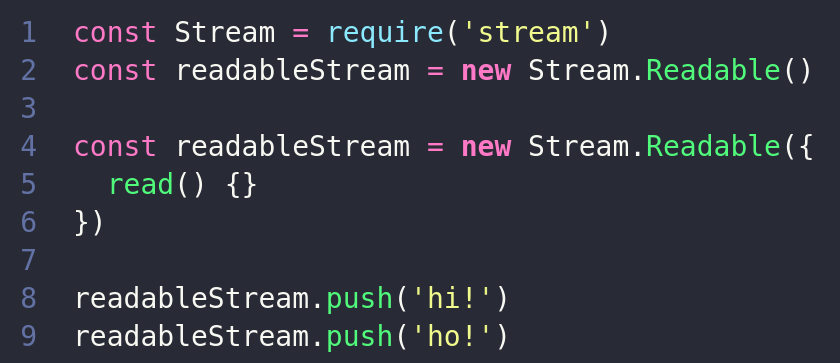

# <!--fit--> Node.js Streams 

---

# **Streams**

Streams são coleções de data (como arrays ou strings). A diferença é que as streams podem não estar disponível na memória tudo de uma vez.

<!-- fonte: https://www.freecodecamp.org/news/node-js-streams-everything-you-need-to-know-c9141306be93/ -->

---

<!-- Contudo streams não são apenas para trabalhar com enormes quantidade de data, elas também server para a composição (composability) no nosso código. -->

<!-- Streams não são um conceito único do node.js, elas foram criadas no Unix décadas atrás para compor comandos enviando através do pipe para outros comandos. -->

---

# Por que streams?

- **Eficiência de Memória**

- **Eficiência de Tempo**

<!-- Streams possuem duas grandes vantagens sobre as outras formas de lidar com dados:   -->

<!-- - **Eficiência de Memória**: não é necessário carregar grande quantidades de dados na memória para ser capaz de processá-los. -->

<!-- - **Eficiência de Tempo**: demora menos tempo para começar a processar os dados, pois é possível começar a processar ele assim que ele é disponível ao invés de ter que esperar por todo o conteúdo. -->

<!-- fonte: https://nodejs.dev/learn/nodejs-streams -->

---

<!-- 1. Buffer -->
<!-- 2. Chunks -->
<!-- 3. Events -->

---

# Buffer

São objetos usados para representar uma sequência de bytes de tamanho fixo

<!-- Você pode pensar no buffer como um array de inteiros, no que cada um representa um byte de dados -->
<!-- Buffer extends Uint8Array -->
<!-- Foram introduzidos para ajudar desenvolvedores a trabalhar com dados binários -->

---

# Chunk

São pequenos pedaços do buffer

---

<!-- Resumindo, trabalhar com streams é como ter um funil que você vai recebendo um dado e vai transformando ele aos poucos -->

---

# EventEmitter

Todas as streams são instâncias do EventEmitter

<!-- Assim como o Buffer e Streams, o EventEmitter também é um módulo do node.js -->

---

<!-- Exemplo do Erick Wendel -->

---

# **Readable Streams**

Uma stream que pode receber dados mas não enviar dados.
Quando dados são adicionados a uma readable stream eles são transformados em buffer até que os dados sejam lidos

---

---

# **Writable Streams**

Uma stream que pode receber dados, mas não enviar dados

---

---

# Eventos

|**Readable Streams**|**Writable Streams**|
|--------------------|--------------------|
|data                |drain               |
|end                 |finish              |
|error               |error               |
|close               |close               |
|readable            |pipe/unpipe         |

---

# Funções

|**Readable Streams**       |**Writable Streams**|
|---------------------------|--------------------|
|pipe(), unpipe()           |write()             |
|read(), unshift(), resume()|end()               |
|pause(), isPaused()        |cork(), uncorck()   |
|setEncoding()              |setDefaultEncoding()|

---

### Exemplos de uso de streams

|**Readable Streams**         |**Writable Streams**         |
|-----------------------------|-----------------------------|
|http responses, no cliente   |http requests, no cliente    |
|http requests, no servidor   |http responses, no servidor  |
|fs read streams              |fs write streams             |
|zlib streams                 |zlib streams                 |
|crypto streams               |crypto streams               |
|TCP sockets                  |TCP sockets                  |
|child process stdout e stderr|child process stdin          |
|process.stdout               |process.stdin, process.stderr|

---

---

# **Duplex Streams**

Uma stream que pode tanto receber, como enviar dados, basicamente uma combinação da Readable e Writable stream

---

# **Transform Streams**

Uma transform strem é similiar a uma Duplex stream, mas a saída é uma transformação da entrada

---

# **Pipe e Pipeline**

O pipe é um mecanismo que pega a saída de uma stream e envia como entrada para outra stream.
No node.js 10 foi introduzido o pipeline, um módulo para tratar erros e finalizar corretamente uma stream finalizada.

---

---

### <!--fit--> :blue_heart:

